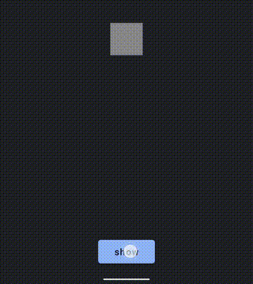

# Ti.popover (Android)

Based on the awesome [Balloon](https://github.com/skydoves/Balloon/) library by [@skydoves](https://github.com/skydoves).



```xml
<Popover module="ti.popover" id="popover">
    <View id="contentView">
        <Label text="test"/>
    </View>
</Popover>

<View id="attach_to"/>
```

```js
$.popover.show({
	view: $.attach_to,
	direction: require("ti.popover").POPOVER_ARROW_DIRECTION_DOWN
})
```
